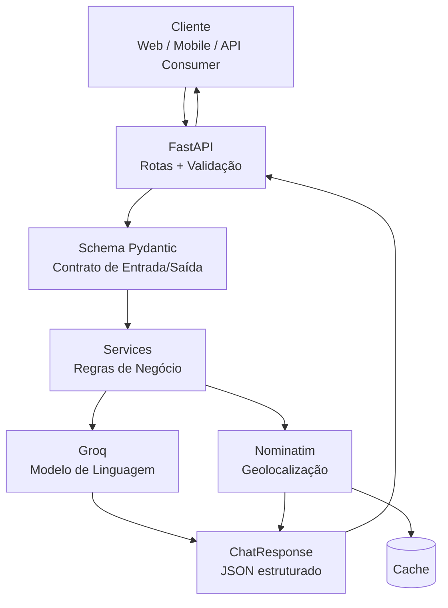

<div align="center">

# Humanizy Med

**Assistente inteligente para orientação em saúde, desenvolvido com FastAPI e integração com modelos de linguagem.**

<p>
  <a href="https://www.python.org/">
    
  </a>
  <a href="https://fastapi.tiangolo.com/">
    
  </a>
  <a href="https://groq.com/">
    
  </a>
  <a href="https://www.openstreetmap.org/">
    
  </a>
  <a href="https://pytest.org/">
    
  </a>
</p>

</div>

---

## Visão geral

O **Humanizy Med** é uma aplicação backend voltada à orientação inicial em saúde. O sistema recebe uma descrição do usuário, processa a solicitação por meio de um modelo de linguagem, identifica a especialidade mais adequada e, quando uma cidade é informada, pode consultar estabelecimentos relacionados à especialidade indicada.

> **Aviso:** o sistema não substitui atendimento médico. A aplicação foi estruturada para fornecer orientação geral e indicar uma especialidade, sem realizar diagnóstico ou prescrição.

---

## Arquitetura

A aplicação utiliza uma arquitetura em camadas para manter separadas as responsabilidades de HTTP, regras de negócio, contratos de dados e integrações externas.



### Princípio da arquitetura

As rotas HTTP não precisam conhecer a implementação do Groq ou do Nominatim. Elas trabalham com services e schemas, permitindo substituir uma integração externa sem reescrever toda a camada HTTP.

---

## Estrutura do projeto

```text
humanizy-med/
├── app/
│   ├── main.py                 # Inicialização da aplicação FastAPI
│   ├── config.py               # Configurações e variáveis de ambiente
│   ├── constants.py            # Lista de especialistas
│   ├── prompts.py              # Prompt de sistema da IA
│   ├── api/
│   │   └── routes/
│   │       ├── chat.py         # POST /chat
│   │       └── health.py       # GET /health
│   ├── schemas/
│   │   └── chat.py             # Contratos Pydantic
│   └── services/
│       ├── ai_service.py       # Integração com Groq
│       └── location_service.py # Integração com Nominatim
├── tests/                      # Testes automatizados
├── docs/                       # Documentação técnica
├── .github/
│   └── workflows/
│       └── ci.yml              # CI: lint + testes
├── Dockerfile
├── requirements.txt
└── requirements-dev.txt
```

---

## Fluxo do `POST /chat`

```text
Cliente
  │
  ▼
POST /chat
  │
  ▼
ChatRequest (Pydantic)
  │
  ├── entrada inválida ──► 422
  │
  ▼
ai_service
  │
  ▼
Groq / Structured Outputs
  │
  ├── falha ──► 502
  │
  ▼
Resultado estruturado
  │
  ├── especialista
  ├── mensagem
  └── emergencia
  │
  ├── cidade informada ──► location_service ──► Nominatim
  │
  ▼
ChatResponse
```

---

## API

### `POST /chat`

#### Request

```json
{
  "message": "Estou com dor de garganta e febre há dois dias",
  "cidade": "Natal"
}
```

#### Response

```json
{
  "mensagem": "Pelo que você descreveu, o ideal é procurar um otorrinolaringologista...",
  "especialista": "otorrinolaringologista",
  "emergencia": false,
  "locais": [
    {
      "nome": "Clínica Exemplo",
      "lat": "-5.79",
      "lng": "-35.21",
      "endereco": "..."
    }
  ]
}
```

### Status codes

| Código | Significado |
|---|---|
| `200` | Triagem concluída |
| `422` | Corpo ou mensagem inválida |
| `502` | Falha na integração com a IA |

### `GET /health`

Endpoint utilizado para health checks e monitoramento.

```json
{
  "status": "ok"
}
```

---

## Decisões técnicas

### Structured Outputs

Em vez de analisar o texto retornado pela IA procurando palavras-chave, o serviço utiliza uma saída estruturada. Dessa forma, campos como `especialista` e `emergencia` possuem formato previsível.

Exemplo do problema da abordagem anterior:

```python
tipo_encontrado = next(
    (e for e in especialistas if e in resposta_texto.lower()),
    "clínico geral"
)
```

Esse modelo depende da ordem da lista e do conteúdo textual gerado pelo modelo.

A abordagem atual trabalha com um contrato estruturado, reduzindo a necessidade de parsing manual.

```python
response_format = {
    "type": "json_schema",
    "json_schema": {
        "name": "medical_triage",
        "strict": True,
        "schema": {
            "type": "object",
            "properties": {
                "mensagem": {"type": "string"},
                "especialista": {
                    "type": "string",
                    "enum": ESPECIALISTAS
                },
                "emergencia": {"type": "boolean"}
            },
            "required": [
                "mensagem",
                "especialista",
                "emergencia"
            ],
            "additionalProperties": False
        }
    }
}
```

### Processamento assíncrono

As integrações externas utilizam clientes assíncronos para evitar bloqueio do event loop do FastAPI durante chamadas de rede.

```python
from groq import AsyncGroq
import httpx

client = AsyncGroq(api_key=settings.groq_api_key)

async with httpx.AsyncClient() as http:
    response = await http.get(url, params=params)
```

### Falha isolada de integração

A integração com a IA é considerada parte central do fluxo. Já a geolocalização possui degradação graciosa: se a busca de locais falhar, a triagem ainda pode ser retornada com `locais: []`.

---

## Configuração

### Pré-requisitos

- Python 3.10+
- Chave da API do Groq

### Instalação

```bash
git clone <URL_DO_REPOSITORIO>
cd humanizy-med

python -m venv .venv

# Linux / macOS
source .venv/bin/activate

# Windows
.venv\Scripts\activate

pip install -r requirements.txt
```

### Variáveis de ambiente

Crie um `.env` a partir do arquivo de exemplo:

```bash
cp .env.example .env
```

Principais variáveis:

| Variável | Obrigatória | Descrição |
|---|---:|---|
| `GROQ_API_KEY` | Sim | Chave utilizada para acessar a API do Groq |
| `GROQ_MODEL` | Não | Modelo utilizado na triagem |
| `CORS_ORIGINS` | Não | Origens autorizadas pela API |
| `NOMINATIM_CONTACT_EMAIL` | Não | E-mail usado nas requisições ao Nominatim |

> Nunca publique um arquivo `.env` contendo credenciais reais no GitHub.

### Execução

```bash
uvicorn app.main:app --reload
```

A API fica disponível em:

```text
http://localhost:8000
```

Swagger:

```text
http://localhost:8000/docs
```

---

## Testes

As integrações externas são mockadas nos testes, evitando chamadas reais para o Groq e o Nominatim.

```bash
pip install -r requirements-dev.txt
pytest -v
```

O pipeline de CI executa lint e testes automatizados a cada push/PR.

---

## Docker

### Build

```bash
docker build -t humanizy-med .
```

### Execução

```bash
docker run -p 8000:8000 --env-file .env humanizy-med
```

---

## Stack

| Tecnologia | Responsabilidade |
|---|---|
| Python | Linguagem principal |
| FastAPI | API HTTP |
| Pydantic | Validação e contratos |
| Groq | Modelo de linguagem |
| httpx | Cliente HTTP assíncrono |
| Nominatim | Busca de localização |
| Uvicorn | Servidor ASGI |
| Pytest | Testes automatizados |
| Ruff | Lint |
| Docker | Empacotamento e execução |
| GitHub Actions | Integração contínua |

---

## Roadmap técnico

<details>
<summary><strong>Próximos passos</strong></summary>

<br>

- Rate limiting no endpoint `/chat`.
- Logging estruturado.
- Histórico e persistência de conversas.
- Autenticação para consumidores externos da API.
- Métricas de latência e erro por integração.
- Cache compartilhado com Redis para múltiplas instâncias.
- Avaliação de provedores de geolocalização conforme crescimento do volume.
- Revisão de requisitos de privacidade e LGPD para o fluxo de dados.

</details>

---

## Segurança e responsabilidade

O projeto trata informações relacionadas a sintomas e orientação de saúde. Por isso, desenvolvimento e operação devem considerar controle de acesso, proteção de credenciais, retenção de dados, observabilidade e requisitos aplicáveis de privacidade.

A aplicação não deve ser apresentada como substituta de um profissional de saúde, nem como ferramenta de diagnóstico ou prescrição.

---

## Licença

Este projeto é disponibilizado sob a licença MIT.

<div align="center">

---

**Humanizy Med**  
*Tecnologia aplicada à orientação em saúde.*

</div>
